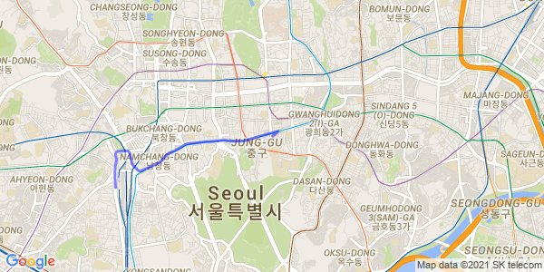
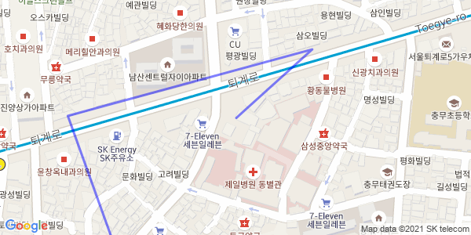

# Prerequisite
Google Static Map API & Direction API are needed

# Features
findDirectionOfNowToDestination(self, origin, dest, mode = "transit", departure_time = "now") 
  - using Direction API to find direction of origin to destination Format : (Longitude,Latitude)   
jsonPathParsing(self, jsonPath) 
  - using parser to parsing json response into needed format
drawImageWithJsonPath(self, stepList, center, zoom = 17, maptype = "roadmap", size = "600x300", color = "0x0000ff", weight = 3) 
  - draw and save image into local drive

# Error occurs when no path is available
# Result
A. Dongguk university to Seoul Station Using encoded polylines 
 
B. Dongguk university to Seoul Station Using longitude latitude steps 
 
C. It is not accurate in case of zooming too much.. TODO 
 

# Todo : 
1. draw map with heading. -> Similar to navigation mode
2. draw road map poly lanes fit into actual road
